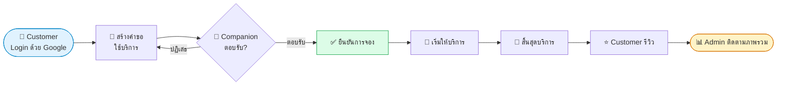

<h1 align="center">
  
  Care Companion
</h1>

### แพลตฟอร์มเชื่อมโยง **ผู้ที่ต้องการผู้ช่วยร่วมเดินทาง** กับ **ผู้ให้บริการร่วมเดินทาง**
*ไปหาหมอ ไปธนาคาร ติดต่อราชการ ซื้อของ หรือทำธุระนอกบ้าน  ไม่ต้องไปคนเดียว*

 

 

### 🌐 [**เข้าใช้งานเว็บไซต์ (Live Demo)**](https://carecompanion-ecru.vercel.app/)

 

---

## ✨ เกี่ยวกับโปรเจกต์

ปัจจุบัน **ผู้สูงอายุ ผู้ที่เดินทางคนเดียวไม่สะดวก หรือผู้ที่ต้องการความช่วยเหลือ** อาจประสบปัญหาเมื่อสมาชิกในครอบครัวไม่สามารถเดินทางไปด้วยได้ เช่น การไปพบแพทย์ตามนัด ไปโรงพยาบาล ไปธนาคาร ติดต่อหน่วยงานราชการ หรือซื้อสินค้า

**Care Companion** คือ Web Application ที่เป็น *แพลตฟอร์มกลาง* เชื่อมโยงระหว่าง

| | |
|---|---|
| 🧓 **Customer** | ผู้ที่ต้องการผู้ช่วยร่วมเดินทาง |
| 🚶 **Companion** | ผู้ให้บริการที่ช่วยเหลือและอำนวยความสะดวกในการเดินทางและการทำธุระ |

> ⚠️ **หมายเหตุสำคัญ:** Companion มีหน้าที่ *ช่วยเหลือและอำนวยความสะดวกในการเดินทางและทำธุระเท่านั้น* **ไม่ใช่** ผู้ให้บริการทางการแพทย์หรือผู้ดูแลรักษาผู้ป่วย

---

## 👥 บทบาทผู้ใช้งาน (Roles)

<table>
  <tr>
    <td align="center" width="33%">
      <h3>🧓 Customer</h3>
      
ผู้ต้องการผู้ช่วยร่วมเดินทาง สร้างคำขอ เลือก Companion ติดตามสถานะ และรีวิว

    </td>
    <td align="center" width="33%">
      <h3>🚶 Companion</h3>
      
ผู้ให้บริการร่วมเดินทาง นำเสนอโปรไฟล์ รับงาน จัดการตารางเวลา และดูรีวิว

    </td>
    <td align="center" width="33%">
      <h3>🛡️ Admin</h3>
      
ผู้ดูแลระบบ บริหารจัดการผู้ใช้ ประเภทบริการ การจอง และภาพรวมแพลตฟอร์ม

    </td>
  </tr>
</table>

---

## 🚀 ฟีเจอร์หลัก

### 🌍 สำหรับทุกคน (Public)
- 🏠 **Landing Page** แนะนำแพลตฟอร์มและข้อมูลที่เหมาะสมต่อการเผยแพร่
- 🔑 **Login ด้วย Google Account** ผ่าน Supabase Authentication

### 🧓 Customer
- 📝 **สร้างคำขอใช้บริการ** ระบุประเภทธุระ วัน เวลา สถานที่ต้นทาง จุดหมาย ระยะเวลา และรายละเอียดเพิ่มเติม
- 🔍 **ค้นหาและเลือก Companion** ที่เหมาะสมกับความต้องการ
- 📋 **จัดการการจอง** ดูรายการ ติดตามสถานะ และประวัติการใช้บริการ
- 🔔 **การแจ้งเตือน** เมื่อมีการตอบรับหรืออัปเดตสถานะ
- ⭐ **รีวิว Companion** หลังสิ้นสุดบริการ
- ⚙️ **ตั้งค่าโปรไฟล์**

### 🚶 Companion
- 👤 **โปรไฟล์ผู้ให้บริการ** แสดงข้อมูลส่วนตัว ประสบการณ์ ความสามารถ พื้นที่ให้บริการ
- 💼 **รายการงาน (Jobs)** ดูคำขอ ตอบรับ หรือปฏิเสธงาน
- 📅 **ตารางเวลา (Schedule)** จัดการช่วงเวลาที่สะดวก
- ⭐ **รีวิวและคะแนน** จาก Customer
- 🔔 **การแจ้งเตือน** เมื่อมีงานใหม่หรืออัปเดต
- ⚙️ **ตั้งค่าโปรไฟล์**

### 🛡️ Admin
- 📊 **Dashboard ภาพรวม** ของแพลตฟอร์ม
- 🚶 **จัดการ Companion** ตรวจสอบและบริหารข้อมูลผู้ให้บริการ
- 🧓 **จัดการ Customer** บริหารข้อมูลผู้ใช้บริการ
- 🏷️ **จัดการประเภทบริการ (Service Types)**
- 📋 **จัดการการจอง (Bookings)** ดูภาพรวมทุกรายการ
- 🔔 **การแจ้งเตือน** และ ⚙️ **ตั้งค่าระบบ**

---

## 🔄 ขั้นตอนการใช้บริการ (User Flow)

> ระบบรองรับกระบวนการตั้งแต่ **ค้นหา/ร้องขอบริการ → ตอบรับ → ให้บริการ → สิ้นสุดบริการ** พร้อมการจัดการสิทธิ์ของผู้ใช้แต่ละประเภท

---

## 📸 Screenshots

### 🏠 Landing Page & Login

<table>
  <tr>
    <td width="50%" align="center">
      <b>Landing Page</b>  
      
    </td>
    <td width="50%" align="center">
      <b>Login ด้วย Google</b>  
      
    </td>
  </tr>
</table>

---

### 🧓 Customer

<b>📌 Dashboard</b>

 

  

<b>📝 สร้างการจองใหม่ &amp; 📋 รายการจอง</b>

 
<table>
  <tr>
    <td width="50%" align="center">
      <b>สร้างคำขอใช้บริการ</b>  
      
    </td>
    <td width="50%" align="center">
      <b>รายการจองของฉัน</b>  
      
    </td>
  </tr>
</table>

<b>🔔 การแจ้งเตือน &amp; ⚙️ ตั้งค่า</b>

 
<table>
  <tr>
    <td width="50%" align="center">
      <b>การแจ้งเตือน</b>  
      
    </td>
    <td width="50%" align="center">
      <b>ตั้งค่าโปรไฟล์</b>  
      
    </td>
  </tr>
</table>

---

### 🚶 Companion

<b>📌 Dashboard</b>

 

  

<b>💼 รายการงาน &amp; ⭐ รีวิว</b>

 
<table>
  <tr>
    <td width="50%" align="center">
      <b>รายการงาน (Jobs)</b>  
      
    </td>
    <td width="50%" align="center">
      <b>รีวิวจากลูกค้า</b>  
      
    </td>
  </tr>
</table>

<b>📅 ตารางเวลา · 🔔 แจ้งเตือน · ⚙️ ตั้งค่า</b>

 
<table>
  <tr>
    <td width="100%" align="center">
      <b>ตารางเวลา (Schedule)</b>  
      
    </td>
  </tr>
  <tr>
    <td width="100%" align="center">
      <b>การแจ้งเตือน</b>  
      
    </td>
  </tr>
  <tr>
    <td width="100%" align="center">
      <b>ตั้งค่าโปรไฟล์</b>  
      
    </td>
  </tr>
</table>

---

### 🛡️ Admin

<b>📊 Dashboard</b>

 

  

<b>👥 จัดการผู้ใช้งาน (Companions &amp; Customers)</b>

 
<table>
  <tr>
    <td width="50%" align="center">
      <b>จัดการ Companion</b>  
      
    </td>
    <td width="50%" align="center">
      <b>จัดการ Customer</b>  
      
    </td>
  </tr>
</table>

<b>🏷️ ประเภทบริการ &amp; 📋 การจอง</b>

 
<table>
  <tr>
    <td width="50%" align="center">
      <b>จัดการประเภทบริการ</b>  
      
    </td>
    <td width="50%" align="center">
      <b>จัดการการจองทั้งหมด</b>  
      
    </td>
  </tr>
</table>

<b>🔔 การแจ้งเตือน &amp; ⚙️ ตั้งค่าระบบ</b>

 
<table>
  <tr>
    <td width="50%" align="center">
      <b>การแจ้งเตือน</b>  
      
    </td>
    <td width="50%" align="center">
      <b>ตั้งค่าระบบ</b>  
      
    </td>
  </tr>
</table>

---

## 🛠 Tech Stack

| หมวด | เทคโนโลยี |
|:---|:---|
| **Frontend / Full Stack** | [Next.js](https://nextjs.org/) + [Tailwind CSS](https://tailwindcss.com/) |
| **Authentication** | Google Account ผ่าน [Supabase Authentication](https://supabase.com/auth) |
| **Database** | [Supabase PostgreSQL](https://supabase.com/database) |
| **File Storage** | [Supabase Storage](https://supabase.com/storage) |
| **Deployment** | [Vercel](https://vercel.com/) |

---

## 🔐 Security & Business Rules

- 🔑 **Authentication**  ต้อง Login ด้วย Google Account ทั้ง Customer และ Companion
- 🛂 **Role-Based Access Control**  แยกสิทธิ์การเข้าถึงหน้าและข้อมูลตาม Role (`customer` / `companion` / `admin`)
- 🗄️ **Row Level Security (RLS)**  ป้องกันข้อมูลในระดับฐานข้อมูลของ Supabase ผู้ใช้เห็นและแก้ไขได้เฉพาะข้อมูลที่ตนมีสิทธิ์
- 🛡️ **Admin**  จัดการข้อมูลของ Customer และ Companion ได้ทั้งหมด
- 🩺 **ขอบเขตบริการ**  Companion ให้บริการช่วยเหลือการเดินทางและทำธุระเท่านั้น ไม่ใช่บริการทางการแพทย์
- 🔒 **Environment Variables**  เก็บ Key ลับไว้ใน `.env.local` และไม่ commit ขึ้น Git

---

## 👨‍💻 ผู้พัฒนา

**ชื่อ-นามสกุล:** นางสาว รัตนากร สุระ
**รหัสนักศึกษา:** 6752410029

 

⭐ *ขอบคุณค่ะ* ⭐

**Made with ❤️ for those who need a companion**

